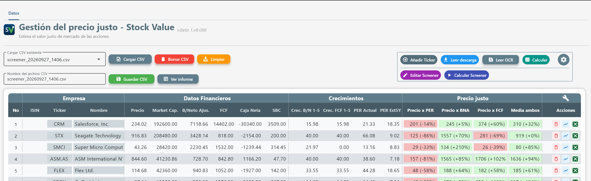
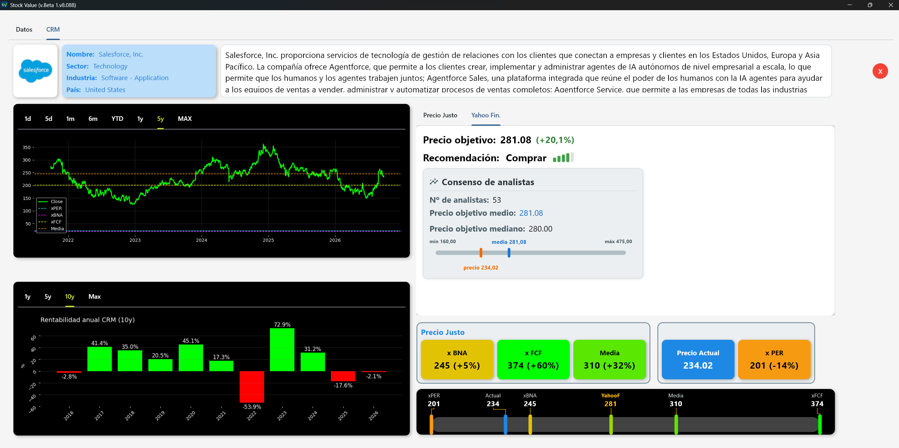
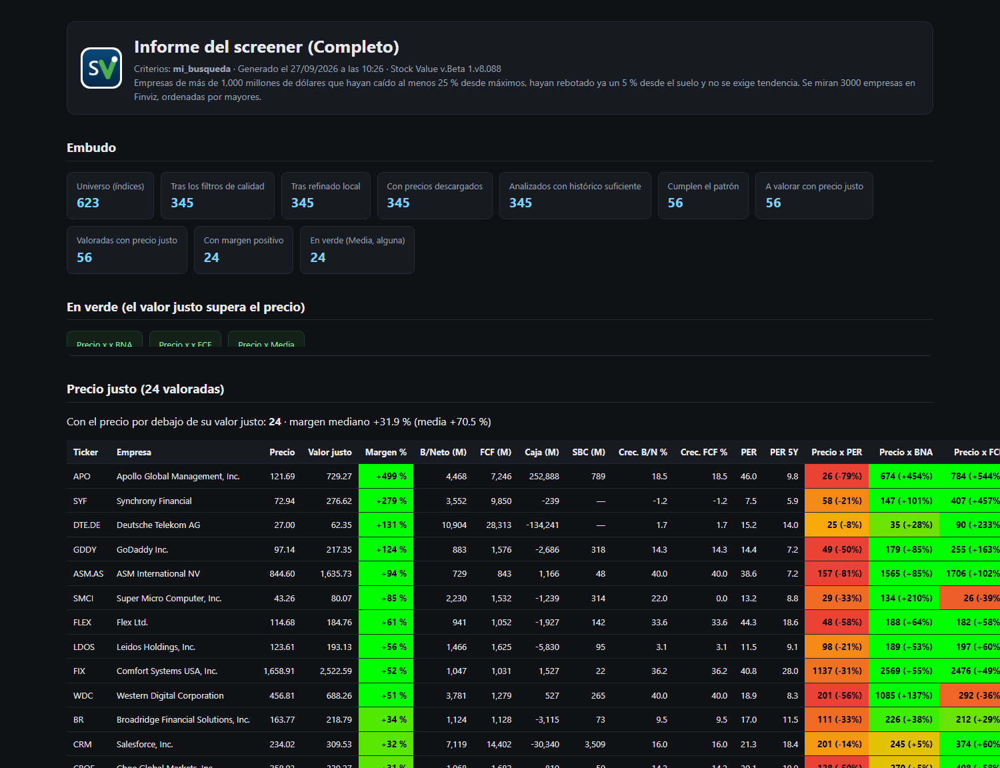
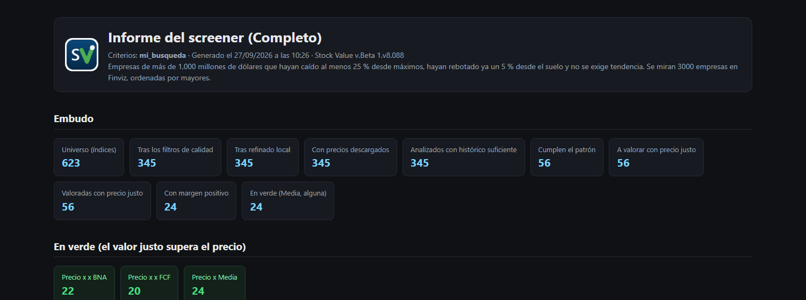

# Stock Value — Gestión del precio justo


Programa de escritorio para **valorar acciones por descuento de flujos futuros (DCF)**, con el SBC incluido: calcula el precio justo, lo enseña con gráficos, lo compara con el consenso de analistas y lo exporta a tu hoja de cálculo.

**Windows 10/11 (64 bits)** · El OCR va incluido: no hay que instalar nada más · Unos 500 MB en el disco, ya instalado.

**[Descargar la última versión](https://github.com/stockvalueapp/stockvalue/releases/latest)** · [Novedades de cada versión](https://github.com/stockvalueapp/stockvalue/releases)

---

## Cómo es

### El panel principal



La lista de empresas con sus datos financieros, sus crecimientos y los cuatro precios justos (PER, B/Neto Ajustado, FCF y la media de los tres), cada uno con su margen y los colores de la escala de la hoja del curso. Los datos entran por descarga, por lectura OCR o a mano; cada empresa se abre con un clic y se puede recalcular al momento. Desde aquí también se lanza el screener y se abre el último informe.

### La valoración de una empresa



Los tres métodos y su media, el margen frente al precio actual, el gráfico de la acción con las líneas del precio justo, la rentabilidad anual de los últimos años y el consenso de analistas de varias fuentes gratuitas.

### El informe del screener



El screener busca empresas al estilo Finviz y deja un informe en `Documentos\Stock Value\informes`: el embudo del filtrado, las empresas que cumplen el patrón y el precio justo de cada una —con los colores de la hoja— ordenadas de mayor a menor margen. Se puede pedir **completo** o **resumido** (una página) y se abre solo al terminar la búsqueda.



---

## Qué hace

- **Calcula el precio justo**: PER, B/Neto Ajustado, FCF y la media de los tres.
- **Muestra la valoración con gráficos** y la compara con el consenso de analistas de varias fuentes gratuitas.
- **Exporta la valoración a tu hoja de cálculo** de Excel.
- **Screener de empresas** al estilo Finviz, con filtro por la valoración del precio justo y **informes** en HTML.
- **Entrada de datos** por descarga, lectura OCR o a mano, y **tus propias watchlists**.
- **Modifica los datos al vuelo** y recalcula la valoración al momento.
- **En español y en inglés**, con guías de ayuda dentro del propio programa.

Los CSV y los informes salen a `Documentos\Stock Value\` (nada más sale del programa).

## Requisitos

- **Windows 10 u 11, de 64 bits.**
- Unos **500 MB** libres en el disco.
- **No hace falta ser administrador**: se instala solo para tu usuario.
- Conexión a internet para descargar los datos de las fuentes gratuitas.

## Descargar e instalar

1. Entra en **[la última versión](https://github.com/stockvalueapp/stockvalue/releases/latest)** y descarga `InstaladorStockValue.exe` (sección **Assets**).
2. Antes de abrirlo por primera vez: botón derecho en el fichero → **Propiedades** → abajo marca **Desbloquear** → **Aplicar**. Es lo habitual en un programa nuevo que no está firmado con un certificado comercial; si no lo haces, Windows enseñará un aviso azul.
3. Sigue el instalador (siguiente, siguiente, instalar) y abre el programa.
4. Pega la **clave de activación** que se te ha facilitado en el curso.

Para desinstalarlo: **Configuración → Aplicaciones → Stock Value → Desinstalar**.

## Comprobar que el fichero es el mío

En las notas de **cada versión** tienes el **SHA-256** del instalador y su **informe en VirusTotal**. Para comprobarlo tú mismo, en PowerShell:

```powershell
Get-FileHash .\InstaladorStockValue.exe -Algorithm SHA256
```

El código que salga tiene que ser exactamente el mismo que el de las notas de la versión que has descargado.

## Ayuda

- Dentro del programa: **Configuración → Guías**, con las instrucciones de cada pantalla.
- Dudas del curso: pregunta a tu profesor.

## Aviso

> Herramienta de filtrado y priorización, **no una recomendación de inversión**. Los datos pueden estar retrasados o contener errores; verifica siempre antes de operar. **Fórmate siempre y toma tus propias decisiones.**

El programa es **educativo**: se activa con la clave del curso. El código fuente no es público; este repositorio se usa para **distribuir el programa y sus actualizaciones**.
